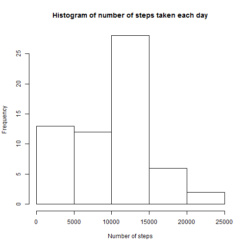
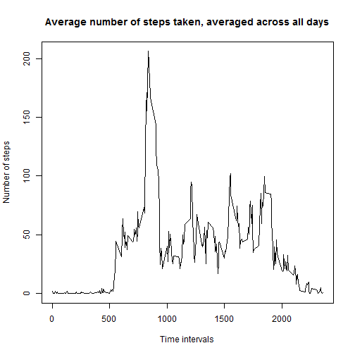
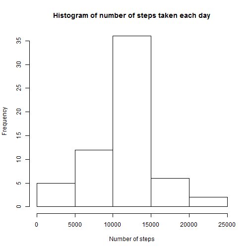

```r
library(knitr)
opts_chunk$set(echo=TRUE)
```

## Loading and preprocessing the data

First of all, what we did was to load the data into R and convert the dates into date format.


```r
library(lubridate)
library(dplyr)
```

```
## 
## Attaching package: 'dplyr'
## 
## The following objects are masked from 'package:lubridate':
## 
##     intersect, setdiff, union
## 
## The following object is masked from 'package:stats':
## 
##     filter
## 
## The following objects are masked from 'package:base':
## 
##     intersect, setdiff, setequal, union
```

```r
file<-read.csv("./activity.csv", header=TRUE , sep=",")
file$date<-ymd(file$date)
```

## What is mean total number of steps taken per day?

Now we will summarize the data in order to compute the total number of steps taken per day.


```r
file2<- file %>% group_by(date) %>% summarize(steps=sum(steps, na.rm=TRUE))
```

Here is the histogram of the number of steps taken each day


```r
hist(file2$steps, main="Histogram of number of steps taken each day", xlab="Number of steps")
```

 

From this data set, we will compute and return mean and median


```r
xbar<-mean(file2$steps)
m<-median(file2$steps)
```

The mean of the number of steps taken per day is 9354.2295082 and the median is 10395.

## What is the average daily activity pattern?

First of all, we will group and summarize the data to compute the mean number of steps by interval.


```r
file3<- file %>% group_by(interval) %>% summarize(steps=mean(steps, na.rm=TRUE))
```

Below is the time serie plot for the mean number of steps, averaged accross all days.


```r
  plot(file3$interval, file3$steps, xlab="Time intervals", ylab="Number of steps", main = "Average number of steps taken, averaged across all days", type="l")
```

 

Now we will compute the interval with the maximum number of steps during the day.


```r
maximum<-file3$interval[file3$steps==max(file3$steps)]
```

The interval with the maximum number of steps is 835.

## Imputing missing values

The first step consists of counting the number of missing values in the dataset.


```r
miss<-sum(is.na(file))
```

In the original dataset, there are 2304 missing values. To clean the data set, we are going to imput missing values.
The missing values are going to be replaced by the mean of the same interval. This will create a clean data set that will be used for further analysis.


```r
v<-which(is.na(file$steps))
  file4<-file
  for (i in v) {
    file4$steps[i]<-file3$steps[file3$interval==file4$interval[i]]
    }
```

With this new data set, we are going to group the data set by date and then we will plot the histogram of number of steps by interval and compute the mean and the median.


```r
file5<- file4 %>% group_by(date) %>% summarize(steps=sum(steps, na.rm=TRUE))
  hist(file5$steps, main="Histogram of number of steps taken each day", xlab="Number of steps")
```

 

We can then compare the mean and the median of the raw data set versus the data set with the imputed values.


```r
xbar2<-mean(file5$steps)
m2<-median(file5$steps)
xbartot<-xbar2-xbar
mtot<-m2-m
```

For the new data set the mean is 1.0766189 &times; 10<sup>4</sup> and the median is 1.0766189 &times; 10<sup>4</sup>. The difference between of means between the 2 data sets is 1411.959171. The difference of the median is 371.1886792.

We can see that imputing the missing values allowed to center the data as in the new data set the mean is equal to the median.


## Are there differences in activity patterns between weekdays and weekends?

To answer this question, we will first create a new variable to identify for each observation if the day was on a weekday or on a weekend.


```r
file4$daytype<-as.factor(ifelse(weekdays(file4$date)=="samedi"|weekdays(file4$date)=="dimanche", "weekend","weekday"))
  file6<- file4 %>% group_by(daytype, interval) %>% summarize(steps=mean(steps, na.rm=TRUE))
```

Now we will plot the average number of steps by interval, throughout the day, compared between weekday and weekend. We can see the result below.


```r
par(mfrow=c(2,1))
  library(lattice)
  xyplot(steps~interval|daytype, layout=c(1,2), data=file6, type="l")
```

 

We can see a significant difference of patterns between the two subsets.
